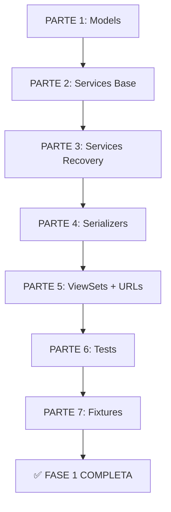

# 🎯 FASE 1: apps/authentication/ - RESUMEN VISUAL

## 📊 DIVISIÓN EN 7 PARTES

```
FASE 1: apps/authentication/
│
├── PARTE 1 (2h) ━━━━━━━━━━━━━━━━━━━━━━
│   ✅ Models (4 modelos)
│   ✅ Constants
│   ✅ Exceptions
│   📝 Commit PARTE 1
│
├── PARTE 2 (1.5h) ━━━━━━━━━━━━━━━
│   ✅ Utils
│   ✅ LockoutService
│   ✅ AuthenticationService
│   📝 Commit PARTE 2
│
├── PARTE 3 (1.5h) ━━━━━━━━━━━━━━━
│   ✅ RecoveryService
│   ✅ SessionService
│   📝 Commit PARTE 3
│
├── PARTE 4 (1h) ━━━━━━━━━━━
│   ✅ Serializers (3 archivos)
│   📝 Commit PARTE 4
│
├── PARTE 5 (1h) ━━━━━━━━━━━
│   ✅ ViewSets
│   ✅ URLs
│   📝 Commit PARTE 5
│
├── PARTE 6 (1h) ━━━━━━━━━━━
│   ✅ Tests centralizados
│   ✅ tests/authentication/
│   📝 Commit PARTE 6
│
└── PARTE 7 (30min) ━━━━━
    ✅ Fixtures
    ✅ Settings
    ✅ Migraciones
    📝 Commit final
```

---

## 🔄 FLUJO DE TRABAJO



---

## 📝 ARCHIVOS POR PARTE

### PARTE 1 (4 archivos)
```
apps/authentication/
├── apps.py          ✅
├── constants.py     ✅
├── exceptions.py    ✅
└── models.py        ✅ (4 modelos)
```

### PARTE 2 (4 archivos)
```
apps/authentication/
├── utils.py                        ✅
└── services/
    ├── __init__.py                 ✅
    ├── lockout.py                  ✅
    └── authentication.py           ✅
```

### PARTE 3 (2 archivos)
```
apps/authentication/services/
├── recovery.py     ✅
└── session.py      ✅
```

### PARTE 4 (4 archivos)
```
apps/authentication/serializers/
├── __init__.py     ✅
├── auth.py         ✅
├── recovery.py     ✅
└── session.py      ✅
```

### PARTE 5 (2 archivos)
```
apps/authentication/
├── viewsets.py     ✅
└── urls.py         ✅
```

### PARTE 6 (6 archivos)
```
tests/authentication/
├── __init__.py             ✅
├── test_models.py          ✅
├── test_services.py        ✅
├── test_serializers.py     ✅
├── test_viewsets.py        ✅
└── test_integration.py     ✅
```

### PARTE 7 (1 archivo + config)
```
apps/authentication/fixtures/
└── security_questions.json  ✅

config/settings/base.py
└── INSTALLED_APPS += 'apps.authentication'  ✅
```

---

## ⏱️ ESTIMACIÓN DE TIEMPO

| Parte | Contenido | Tiempo | Acumulado |
|-------|-----------|--------|-----------|
| 1 | Models + Constants + Exceptions | 2h | 2h |
| 2 | Utils + Services Base | 1.5h | 3.5h |
| 3 | Services Recovery + Session | 1.5h | 5h |
| 4 | Serializers | 1h | 6h |
| 5 | ViewSets + URLs | 1h | 7h |
| 6 | Tests Centralizados | 1h | 8h |
| 7 | Fixtures + Integración | 30min | 8.5h |

**Total: 8.5 horas**

---

## ✅ COMMITS POR PARTE

```bash
# PARTE 1
git commit -m "FASE 1 - PARTE 1: Models + Constants + Exceptions"

# PARTE 2
git commit -m "FASE 1 - PARTE 2: Utils + Services Base"

# PARTE 3
git commit -m "FASE 1 - PARTE 3: RecoveryService + SessionService"

# PARTE 4
git commit -m "FASE 1 - PARTE 4: Serializers"

# PARTE 5
git commit -m "FASE 1 - PARTE 5: ViewSets + URLs"

# PARTE 6
git commit -m "FASE 1 - PARTE 6: Tests Centralizados"

# PARTE 7
git commit -m "FASE 1 - PARTE 7: Fixtures + Integración

✅ apps/authentication/ COMPLETA

Implementado:
- 4 modelos
- 4 servicios
- 9 endpoints autenticación
- 2 endpoints sesiones
- Tests completos
- 10 preguntas de seguridad

Compliance:
- CNST-001: SIN email
- CNST-005: PBKDF2 + Token + Session
- CNST-010: Sessions en PostgreSQL
- CNST-031: Auditoría completa"
```

---

## 🎯 CARACTERÍSTICAS PRINCIPALES

### CNST-001: SIN Email ✅
```python
# ❌ PROHIBIDO
def reset_password_by_email(email):
    send_mail(...)

# ✅ IMPLEMENTADO
def reset_password_by_questions(username, answers):
    recovery_service.verify_security_answers(...)
```

### CNST-005: Seguridad ✅
```python
# Lockout automático
MAX_LOGIN_ATTEMPTS = 5
LOCKOUT_DURATION_MINUTES = 15

# PBKDF2 hashing
user.set_password(password)
UserSecurityAnswer.set_answer(answer)
```

### CNST-031: Auditoría ✅
```python
# Todos los intentos registrados
LoginAttempt.objects.create(
    username=username,
    success=True/False,
    ip_address=ip,
    user_agent=ua
)

# Todas las sesiones registradas
SessionLog.objects.create(
    user=user,
    session_key=key,
    login_at=now()
)
```

---

## 🚦 PRÓXIMO PASO

### ¿Quieres que:

1. **Ejecute PARTE 1** (Models + Constants + Exceptions) AHORA?
2. **Revise código específico** de alguna parte?
3. **Cree fixtures** de preguntas de seguridad primero?
4. **Vea ejemplo** de algún servicio antes de empezar?

**Todo el plan está listo y documentado** 📝

---

## 📚 DOCUMENTOS RELACIONADOS

- **FASE_1_PLAN_7_PARTES.md** - Plan completo con código
- **FASE_0_RESUMEN_EJECUTIVO.md** - Estado actual
- **PLAN_EJECUTABLE_v2_0_0.md** - Guía general
- **CORRECCION_RBAC_NOMENCLATURA.md** - Nomenclatura correcta

---

**Documento generado:** 2026-01-21  
**Estado:** ✅ PLAN LISTO  
**Próximo:** Ejecutar PARTE 1 (2h)
